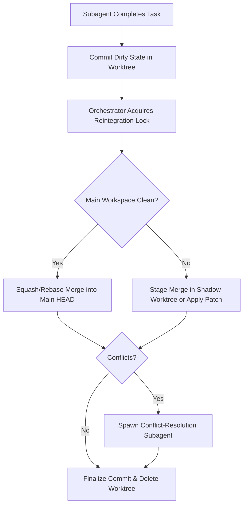

# Git Worktree Synchronization & Isolation Design for Parallel Coding Agents

This document details the concrete mechanics, on-disk layouts, Git commands, and concurrency controls used for managing parallel agent workspaces with Git worktrees.

---

## 1. Lifecycle & Trigger

* **Workspace Modes**:
  * `inherit`: Subagent runs directly in the parent workspace (default for read-only research, codebase grep/view, and sequential scripts).
  * `branch` / `share`: Dedicated isolated worktree provisioned for mutating tasks (code generation, refactoring, exploratory execution).
* **Trigger Strategy**:
  * **Eager initialization**: When a subagent is invoked with mutating permissions (`Workspace: 'branch'`), the worktree is created during agent bootstrap before the first tool call runs.
  * **Read-only bypass**: Agents configured without write tools (e.g., dedicated search/research subagents) operate exclusively via read tools (`view_file`, `grep_search`, `list_dir`) against the primary checkout, bypassing worktree allocation entirely.
* **Escalation**: If a read-only agent dynamically requests write delegation, the orchestrator provisions a worktree on demand prior to executing the mutating tool.

---

## 2. Base Ref & Branch Mechanics

* **Base Commit Strategy**:
  * Always branch from the **parent checkout's current local `HEAD`** commit hash (`git rev-parse HEAD`), **never** `origin/default` or a symbolic branch name.
  * *Why*: If the developer has local unpushed commits or is on a detached head/feature branch, branching from remote or default branches would immediately fork away from their working state.
* **On-Disk Layout & Naming Conventions**:
  * **Branch Name**: `agent/<parent-session-id>/<subagent-role-slug>-<short-id>`  
    *(Example: `agent/e5d09bee/db-refactor-f4a1`)*
  * **Worktree Directory**: Stored outside the user's primary repo folder to prevent IDE file-watchers and search indexers from choking on duplicate trees:  
    `%LOCALAPPDATA%\antigravity-cli\worktrees\<session-id>\<agent-id>\` (Windows) or `~/.cache/...` (Linux/macOS).
* **Command Sequence**:
  ```bash
  BASE_SHA=$(git rev-parse HEAD)
  git worktree add -b "agent/<session-id>/<agent-id>" "<worktree-path>" "$BASE_SHA"
  ```

---

## 3. Untracked & Gitignored State (`.env`, `node_modules`, Build Caches)

A fresh `git worktree add` contains only tracked files. Re-running `npm install`, `cargo build`, or recreating Python virtual environments from scratch per task is prohibitively slow.

* **Secrets & Environment Configs (`.env*`, local config)**:
  * Hardlink (`fs.link` on NTFS/ext4) all untracked `.env*`, `local.settings.json`, and `.npmrc` files directly from the parent workspace root into the worktree root. Hardlinks take zero extra disk space and propagate environment edits instantaneously.
* **Dependency Management**:
  * **Node / JavaScript**:
    * If using `pnpm` (content-addressable store), run `pnpm install --prefer-offline` (~1–2s).
    * If using standard `npm`/`yarn` with a pre-existing parent `node_modules`, create an NTFS Directory Junction (`mklink /J node_modules <parent_path>\node_modules`) for read-heavy dependencies, or copy via hardlink clones (`robocopy /sl /e` on Windows, `cp -al` on Unix) if the agent is expected to add/modify packages.
  * **Python**:
    * Inject parent environment variables (`VIRTUAL_ENV=<parent_path>/.venv`, prepending `<parent_path>/.venv/Scripts` or `bin` to `PATH`) rather than building duplicate virtualenvs.
  * **Compiled Languages (Rust, Go, Java)**:
    * Share global build caches by injecting target variables into agent commands (e.g., `CARGO_TARGET_DIR=<shared-cache>`, `GOCACHE=<shared-cache>`).

---

## 4. Granularity & Reuse

* **Granularity**: Exactly **one worktree per subagent conversation instance**.
* **Why not per-task/per-command**: Command-level worktrees cause unbearable setup/teardown churn.
* **Why not shared across agents**: Multiple parallel agents executing concurrent writes, builds, and test runs in the same worktree stomp on each other’s intermediate compiler output and index locks.
* **Turn Retention**: A subagent keeps its worktree across multi-turn interactions (e.g., parent reviews output, sends `send_message` with revisions).
* **Pool Recycling**: Worktrees are **not pooled/recycled**. Scrubbing uncommitted state, untracked artifacts, and lingering process locks from dirty trees is slower and more fragile than `git worktree remove` + clean re-branching.

---

## 5. Reintegration & Merge Workflow



* **Landing Strategy**:
  1. The subagent commits its working tree:
     ```bash
     git -C "<worktree-path>" add -A
     git -C "<worktree-path>" commit -m "agent(<role>): <task summary>"
     ```
  2. Reintegration into the target branch is **strictly serialized** using an in-process FIFO mutex/lock.
  3. Default landing is a **squash merge** (`git merge --squash agent/<session-id>/<agent-id>`) to keep git history readable, attributing author metadata to the subagent task.
* **Conflict Resolution**:
  * If merge conflicts occur, the orchestrator extracts conflicting hunks (`git diff --name-only --diff-filter=U`) and spins up an automated resolver prompt inside the agent's worktree to reconcile the hunks before re-attempting parent landing.
  * If resolution fails or confidence is low, the branch is preserved, and the raw diff is presented to the user with conflict markers highlighted.

---

## 6. Concurrency Safety & Git Internals

Worktrees share `.git/objects/`, `.git/refs/remotes/`, and `.git/config`, while maintaining independent `.git/worktrees/<name>/` (`index`, `HEAD`, and private refs).

* **Suppressing Auto-GC**:
  * Concurrent `git gc` or `git prune` can prune loose objects while another agent is writing tree objects.
  * All agent-invoked git commands explicitly disable automatic garbage collection:
    ```bash
    git -c gc.auto=0 <command>
    ```
* **Remote Fetch & Lock Synchronization**:
  * `git fetch` and remote operations update shared refs (`.git/refs/remotes/`) and can encounter `packed-refs.lock` collisions. All network/fetch operations are funneled through a global process mutex (`.git/agent_fetch.lock`).
* **Micro-commit Verification**:
  * Pre-commit hooks (`.git/hooks/pre-commit`) are skipped on internal agent milestone commits using `--no-verify`, executing full linters/hooks only during the final parent reintegration gate.

---

## 7. Non-Isolated Surfaces

| Surface | Isolation Status | Serialization / Guard Mechanism |
| :--- | :--- | :--- |
| **Network Ports** | Shared | Dynamic port leasing (injecting `PORT=0` or assigning distinct ports from a runtime pool like `3100`, `3101`). |
| **Package Manager Cache** | Shared (`~/.npm`, `~/.cargo`) | Package managers have built-in file locks; concurrent runs use a concurrency limiter to avoid cache file corruption. |
| **Git Hooks & Config** | Shared (`.git/config`) | Worktree-specific configs are scoped via `git config --worktree` (`extensions.worktreeConfig`). |
| **Docker / Test DBs** | Shared | DB containers are partitioned via randomized schema names (`test_schema_<agent_id>`) or ephemeral SQLite DB files. |
| **Global User Config** | Read-only | Mutation of `~/.gitconfig` or global CLI settings is blocked. |

---

## 8. Cleanup & Failure Handling

* **Standard Cleanup**:
  ```bash
  git worktree remove --force "<worktree-path>"
  git branch -D "agent/<session-id>/<agent-id>"
  git worktree prune
  ```
* **Orphan & Crash Recovery**:
  * On orchestrator startup, the CLI scans `.git/worktrees/`. Any entry whose metadata maps to a terminated PID or completed session ID is purged via `git worktree prune --verbose`.
* **Windows File-Lock Handling (`EBUSY`, `EPERM`, `Access Denied`)**:
  * On Windows, background compiler daemons (`rust-analyzer`, `tsserver`, Java build daemons) or antivirus indexers frequently hold file handles, blocking directory removal.
  * **Mitigation**:
    1. **Process Tree Kill**: Terminate child processes via Windows Job Objects before cleanup.
    2. **NTFS Rename-and-Purge**: If directory deletion fails due to locks, rename the target worktree directory to `%LOCALAPPDATA%\antigravity-cli\trash\<uuid>` (Windows allows renaming directories with open file handles, even when deletion is denied). A background scavenger thread cleans the trash directory upon process exit or system reboot.
    3. Run `git worktree prune` to unlink the worktree from Git's internal tracking metadata regardless of on-disk file locks.

---

## 9. Uncommitted Carryover from Main Checkout

When a user asks an agent to operate on code that includes dirty, uncommitted changes in the main working tree:

* **Shadow Commit Generation (Zero Workspace Disruption)**:
  Instead of running `git stash` (which disrupts the user’s active IDE buffers and triggers editor reload flickers), create a shadow commit object in Git’s object store without advancing the active branch ref:
  ```bash
  # 1. Capture current dirty index + working tree into a git tree object
  TREE_SHA=$(git write-tree)
  
  # 2. Create an ephemeral commit parented to current HEAD
  SHADOW_SHA=$(git commit-tree "$TREE_SHA" -p HEAD -m "shadow base: dirty carryover")
  
  # 3. Provision the worktree branching from the shadow commit
  git worktree add -b "agent/<session-id>/<agent-id>" "<worktree-path>" "$SHADOW_SHA"
  ```
* *Result*: The agent worktree boots instantly with an exact duplicate of the user’s dirty state, while the user’s active working directory remains untouched.

---

## 10. Surfacing & User Visibility

* **Active Agent Status**:
  * The orchestration runtime surfaces real-time state via the Auxiliary Subagents Pane and CLI status lines, displaying:
    * Subagent Role & ID: `Database Migration Specialist` (`agent-9a2c`)
    * Branch Name: `agent/e5d09bee/db-migration-9a2c`
    * Workspace Path: `C:\Users\...\worktrees\e5d09bee\db-migration-9a2c`
    * Execution State: `Running`, `Idle`, `Reintegrating`
* **Pre-Landing Diff Inspection**:
  * Prior to reintegration, a unified diff is generated against the initial base ref:
    ```bash
    git diff <BASE_SHA>..agent/<session-id>/<agent-id> --stat
    git diff <BASE_SHA>..agent/<session-id>/<agent-id>
    ```
  * The file changes and visual hunk breakdown are presented to the user for interactive approval or side-by-side IDE review before merging into the main checkout.
